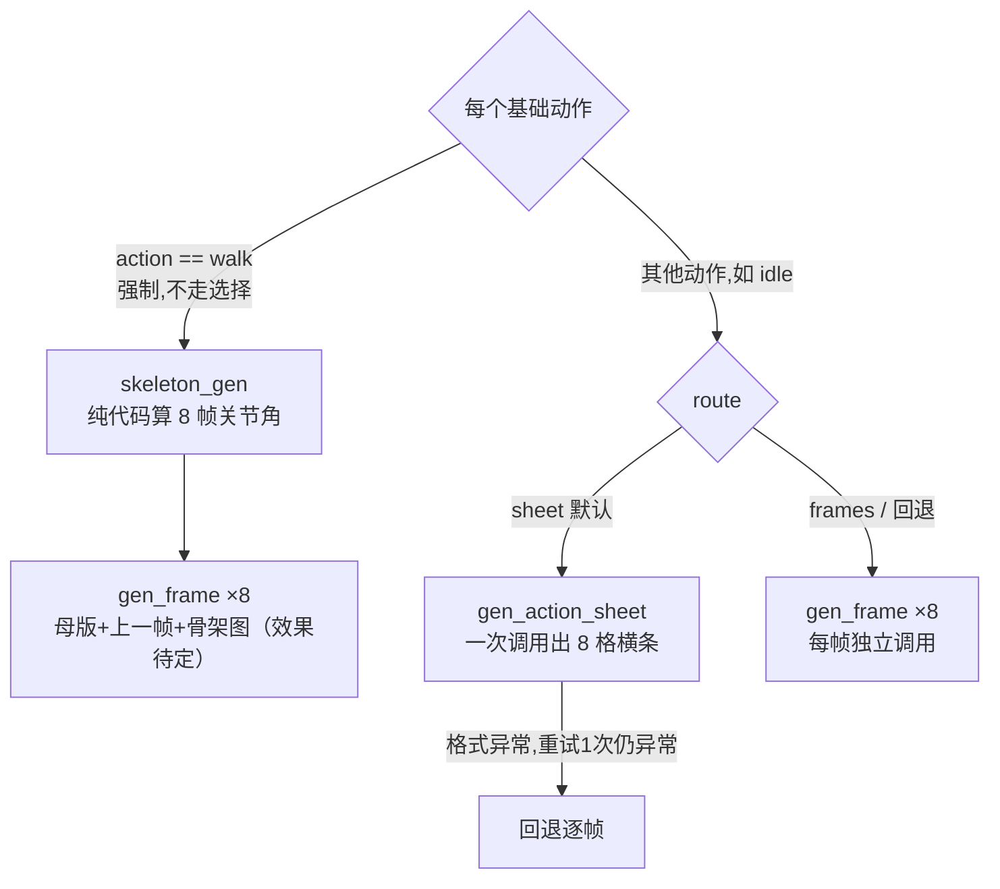

---

## 第 0 步:前端界面

这是 `asset-lab/create-character.html` 渲染出来的创建界面:


对应关系:

| 界面上的字段 | 请求体里的字段 | 作用 |
|---|---|---|
| 视觉风格(留空交给模型) | `style` | 拼进母版 prompt 的 `Art direction:` 一句 |
| 整体配色 | `palette` | 拼进母版 prompt 的 `Color scheme:` 一句 |
| 资产名称 | `name` | 角色目录里的显示名 |
| 身份描述(年龄/身形/发型/道具/气质) | `description` | 每一步 prompt 里反复出现的"角色是谁" |
| 图像模型下拉框 | `model` | 传给七牛云 QnAIGC 的具体模型名 |
| 待机 / 行走勾选框 | `starterActions` | 决定这次要跑哪几个基础动作 |

点"生成"按钮,触发的是(`asset-lab/create-character.js`):

```js
const job = await api.post('/api/characters/generations', {
  name: els.assetName.value.trim(),
  description: els.description.value.trim(),
  style: els.styleInput.value.trim(),
  palette: els.paletteInput.value.trim(),
  model: provider.model,
  starterActions: generationDefaults.starterPack.actions.filter((action) => (
    action === 'idle' ? els.starterIdle.checked : action === 'walk' ? els.starterWalk.checked : false
  )),
});
```

浏览器发出这一个 POST 之后,界面立刻切到"整体审核"步骤,右侧"候选角色包"面板显示"等待生成"。转移到后端。

---

## 第 1 步:请求进后端,开一个后台任务

`server/app.py` 收到这个 POST,校验完参数后,交给 `GenerationApplication`,后者在一个新的 daemon 线程里跑 `GenerationExecutor.run_character`,同时立刻把 `job.status = "generating"` 返回给前端。

---

## 第 2 步:生成角色母版(`generate.gen_character`)

后端第一件事,是拿 `description` + `style` + `palette` 拼一句 prompt,调一次图像模型,画出角色"中性站立"的母版:

```python
def gen_character(char_desc, out_path, style="", palette="", model=None, api_key=None):
    style_line = f"Art direction: {style}. " if style else ""
    palette_line = f"Color scheme: {palette}. " if palette else ""
    txt = ("Create ONE original full-body pixel-art game character master sprite. "
           f"Character definition: {char_desc}. {style_line}{palette_line}"
           "Neutral standing pose, pseudo-side 3/4 view facing RIGHT. Clean readable silhouette. "
           f"{config.BG_MAGENTA}. {config.NO_SHADOW}. Character centered, full body head-to-feet, no text, no frame.")
    return _call(txt, [], out_path, model=model, api_key=api_key)
```

这一步真实产出的原图(纯品红底,没去背):


"去背"——`matte_chroma` 会去量图片四个角的颜色当"键色",跟键色够接近的像素直接变透明:

```python
def matte_chroma(source, destination):
    image = Image.open(source).convert("RGBA")
    pixels = image.load()
    corners = [pixels[0, 0], pixels[width-1, 0], pixels[0, height-1], pixels[width-1, height-1]]
    key = tuple(sum(pixel[c] for pixel in corners) / len(corners) for c in range(3))
    for y in range(height):
        for x in range(width):
            r, g, b, _ = pixels[x, y]
            distance = math.sqrt((r-key[0])**2 + (g-key[1])**2 + (b-key[2])**2)
            alpha = max(0, min(255, round((distance - 18) / 110 * 255)))
            pixels[x, y] = (r, g, b, alpha)
    ...
    if _foreground_ratio(image) > 0.6:      # 抠完前景还占六成以上,说明键色没抠动
        cutout(source, destination)          # 回退:AI 主体分割再试一次
        if 仍然 > 0.6: raise RuntimeError    # 两次都不行,拒绝这一帧,要求重新生成
```

再经过 `normalize_frame` 按脚底基线贴进 256×256 透明画布,母版就绪、发布给前端第一张点亮:


---

## 第 3 步:母版门禁——生成完不代表能用

母版 prompt 里写了"pseudo-side 3/4 view facing RIGHT",但模型不一定听话——如果画出一张正脸或者朝左的母版,后面所有动作的 prompt(都假设"朝右侧身")会跟这张母版自相矛盾,整包角色报废。所以生成后立刻拿一次视觉模型(VLM)回头检查这张图本身:

```python
for attempt in range(2):
    generate.gen_character(...)
    card = describe.describe_character(str(raw), api_key=api_key)   # VLM 判定 view/facing
    view_ok = card["view"] in {"profile", "pseudo-side", "three-quarter"}
    facing_ok = card["facing"] != "left"
    if view_ok and facing_ok:
        break
    if attempt == 1:
        raise RuntimeError("母版两次都不是朝右的侧面/四分之三视角，请调整角色定义后重试")
```

不合格,重新生成一次母版再判一次;还不合格,整个任务失败,提示你调整角色描述;如果是判定服务本身出错(比如 VLM 调用超时),门禁选择放行而不是卡死整个任务。

---

## 第 4 步:idle 与 walk

母版就绪后,后端对勾选的每个动作(idle / walk)分别生成 8 帧。idle 和 walk 走的是两套不同机制:



### 4A. idle 走sheet（动作条），一次调用，省钱且相对来说一致性较好，但是需要后续切分工程

`gen_action_sheet` 一次性要求模型画出一整条 8 格横向连环画,8 个相位全部塞进一次调用里:

```python
text = (
    "Create ONE ultra-wide horizontal pixel-art sprite action strip from the reference character. "
    "The canvas MUST be landscape, close to 8:1 ... never multiple rows. "
    "The strip must contain EXACTLY 8 equal panels in one row ... "
    "Preserve the EXACT same identity ... in every panel. "
    f"Character identity: {char_desc}. Action: {action}. Camera: true {view} game view. "
    "EVERY panel must face the SAME direction as the reference character; NEVER mirror or flip any panel. "
    "Keep the character at identical scale and the feet on one shared ground line. ..."
)
```

真实跑出来的 idle 动作条原图(8 格连在一起):


这条图不能直接用,要先 `matte_chroma` 抠掉品红底,再交给 `split_action_sheet` 按格切开——切分前先做一次格式校验,再算一个**全条共用**的缩放系数(不是每格各自缩放,免得手臂张开的宽姿势被单独缩小、跟别的帧比例对不上):

```python
if frame_count != 8 or width < height * 3 or width // frame_count < 32:
    raise RuntimeError("生成结果不是可切分的 8 帧横向动作条")   # 拒收多行网格等畸形返回
crops = [image.crop((round(i*width/8), 0, round((i+1)*width/8), height)) for i in range(8)]
boxes = [crop 的可见区域 bbox for crop in crops]
scale = min(fit_scale(box) for box in boxes)          # 全条只算一次,8 帧共用
for i, crop in enumerate(crops):
    normalize_frame(crop, output[i], action, i, scale)  # 每帧用同一个 scale
```

切出来的单帧(第 1 / 3 / 5 / 7 帧为例,能看出呼吸带来的细微起伏):


*(如果你数一下这几帧手上的法杖,会发现有几帧法杖没画出来——这类"跨帧道具丢失"正是`sequence_quality`覆盖率检查也未必能拦住、需要人工审核才能抓到的问题。)*

sheet 格式校验失败会先重试一次动作条调用,两次都失败才回退到 4B 的逐帧路线(`frames-fallback`)。

### 4B. walk 强制走"骨架引导逐帧"——不再让模型猜姿势（可行性和骨架约束还需要后续验证）

行走这个动作,四肢摆动幅度大,交给模型凭文字描述去猜"手脚该摆在哪",漂移和穿模概率明显更高。所以 walk **不参与上面 sheet/frames 的选择**:

```python
if route == "frames" or action == "walk":
    return self._frames(..., route="frames")   # walk 无条件进这里，跳过 sheet 整条判断
```

进入 `_frames` 之后,先用纯代码(零 AI、零角色)算出 8 帧关节角骨架图——这是 `skeleton_gen.make_walk_skeletons`,靠正弦函数逐帧摆动髋、膝、踝、肩、肘、手,画在一张纯几何图上:

```python
t = i / n * 2 * math.pi + math.pi / 2   # 相位偏移 +π/2,使第1帧=接触位,对齐姿势合同的 WALK CONTACT
hipang = 32 * math.sin(phase)            # 大腿摆动角
bend = max(0, -math.sin(phase)) * 45 + max(0, math.sin(phase - 1.2)) * 15   # 小腿弯曲
d.line([(40, GROUND_Y), (W-40, GROUND_Y)], ...)   # 8 帧共用同一条地平线 y=494
```

生成的 8 张骨架条件图(白点是关节定位点,灰线是固定地平线,亮色是近侧肢体、暗色是远侧,用来解决侧视图左右腿混淆):


这是喂给 `gen_frame` 的第三张参考图,让 AI照着骨架把已经定好的角色画上去
```python
def gen_frame(base_path, char_desc, pose_desc, out_path, skeleton_path=None, prev_path=None, model=None, api_key=None):
    ...
    refs = [base_path] + ([prev_path] if prev_path else []) + ([skeleton_path] if skeleton_path else [])
    if prev_path:
        txt = "Image 1 = character identity master. Image 2 = the PREVIOUS animation frame; " \
              "match its costume, colors and held items exactly, changing only the pose. " + txt
    if skeleton_path:
        txt = ("The LAST reference image is an OpenPose skeleton defining the EXACT pose for this frame: "
               "white dots mark joints ... the gray horizontal line is the fixed ground anchor ... "
               "but NEVER draw the line, dots or any skeleton element in the output image. " + txt)
```

三张参考图各司其职:**母版**锁身份和配色,**上一帧**锁服装道具的跨帧连续性,**骨架图**锁这一帧具体的姿势——AI 只剩"照着画"这一件事可做,不再有"自由发挥"的空间。真实跑出来的 8 帧成品(全部朝右、身份没漂移、步态相位清晰):


代价是:walk 从"sheet 路线 1 次调用"变成"8 次独立调用",单个动作的生成耗时和成本都涨了 8 倍,且骨骼是否可靠需要考证，例如这里腿就看起来没动，可能是因为图像模型对于左右腿识别不清，也可能是因为中间没有约束的关键帧。

---

## 第 5 步:拼成动画——动画从何而来

这两条路线最终产出的都是 8 张独立的静态 PNG(`normalized/idle-01.png` … `idle-08.png` 或 `walk-01.png` … `walk-08.png`)。动画是这 8 张图被审核通过、正式入库之后,由前端/Cocos 运行时按固定 8 FPS 顺序播放这 8 张图产生的视觉效果。GIF不是管线的产物:


---

## 第 6 步:质检(`processing.sequence_quality`)

8 帧(不管来自哪条路线)生成完,过一次纯几何质检——量每一帧的包围盒尺寸、水平中心、脚底 y 坐标、前景覆盖率,跟其余帧比较波动:

```python
if height_spread > 0.28: warnings.append("主体高度波动过大")
if center_spread > 42:   warnings.append("主体水平中心漂移过大")
if action != "jump" and foot_spread > 5: warnings.append("脚底基线不连续")
if any(m["coverage"] > 0.5 for m in metrics): warnings.append("疑似存在背景未去除的帧")
```

这一步**只管几何,不管语义**——步态对不对、道具有没有跨帧消失、衣服颜色有没有跳变,这些质检代码看不出来,`semanticReviewRequired` 恒为真,永远转人工审核兜底。

---

## 第 7 步:回到界面——轮询

后端每完成一批(sheet 是一次性 8 帧,frames 是每完成 1 帧就发布 1 次),就把最新的 `outputs` 写进 job 状态。前端 `job-poller` 每 900ms 问一次后端"现在到哪了",`renderAssetPackage` 只把**新出现**的帧追加到候选角色包面板里,并触发一次"点亮"入场动画——这就是为什么用 frames 路线的时候,你能看到候选面板里的帧一张一张蹦出来,而 sheet 路线是 8 张同时出现。


